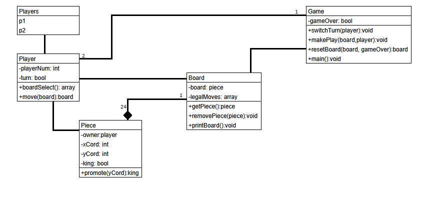
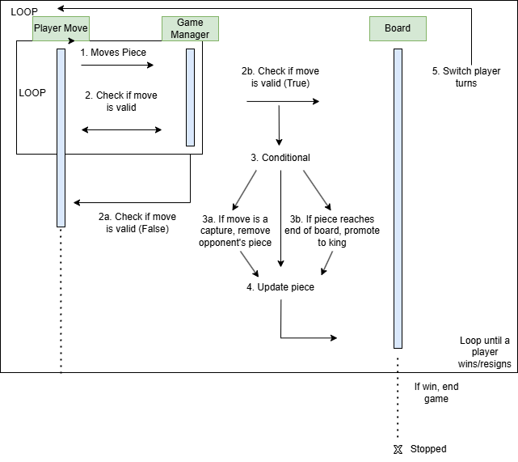

# Checkers

California State University, Fullerton repository for CPSC 362 Foundations of Software Engineering.

Checkers is a full-stack game hosted on a web application that allows one player to play against another player locally. Using the same computer, the players will be playing the game of checkers on a two-sided checkered board in which each player will take turns for each round to move their pieces diagonally until one player is eliminated. If our game is completed earlier than expected, future features will be implemented, and server-side gameplay can be implemented with a computer/player.

The front-end will be implemented in HTML/CSS and JavaScript, and the back-end will be implemented in Python.

## Requirement Models

  
  

    Figure 1. UML Class Diagram
  

 
 

  
  

    Figure 2. UML Sequence Diagram
  

## Getting Started

## Styleguide

The linter that will be used for the front-end development will be Prettier.
The linter that will be used for the back-end development will be Black. Both linters will be automated and ran through GitHub Actions.

## Built With
**Operating Systems:** 
- Ubuntu
- Windows

**Text Editors:**
- Visual Studio Code

**Linters:**
- Black (for Python)
- Prettier (for HTML/CSS/JavaScript)

**Linker:**

**Compiler:**

**Web Framework:**

## Future Updates

## Authors
**Front-end developers:**  
Dylan Phan  
Sony Kim  
Samson Du  
Andrew Mankin  

**Back-end developers:**  
Kevin Chau  
Azaan Mavandadipur  
Collin Woelfl  
Kayla Ngo  

## License
